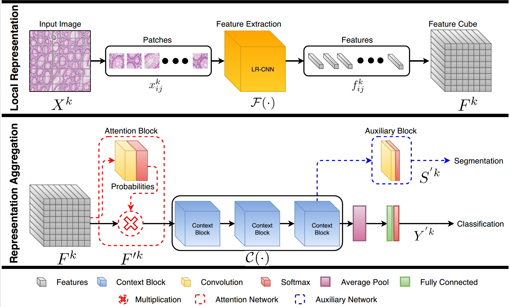

# [Context-Aware Convolutional Neural Network for Grading of Colorectal Cancer Histology Images](https://tia-lab.github.io/Context-Aware-CNN/)

### Table of Contents
0. [Introduction](#introduction)
0. [Citation](#citation)
0. [Dataset](#Dataset)
0. [Model](#model)
0. [Prerequisites](#prerequisites)
0. [License](#License)

### Introduction

This repository contains the implementation of Context-Aware CNN as described in the paper.

### Citation

The journal paper on this work is currently under review in **IEEE Transactions on Medical Imaging**. If you want to refer this work in your research, please cite our arXiv preprint on this work:


### Dataset

We have plan to release the train and validation dataset after acceptance of our paper. Please contact Prof. Nasir Rajpoot (n.m.rajpoot@warwick.ac.uk) for dataset related queries.

### Training


### Model

### Prerequisites
Following software packages will be required to run this code:

```
-- Python 3.5
   -- tensorflow-gpu=1.8.0
   -- keras=2.1.6
   -- openslide
   -- opencv_python
   -- scipy
```
## Authors

See the list of [contributors](https://github.com/TIA-Lab/Context-Aware-CNN/graphs/contributors) who participated in this project.

## License

This project is licensed under the GNU General Public License - see the [LICENSE.md](https://github.com/TIA-Lab/Context-Aware-CNN/blob/master/License.md) file for details.
